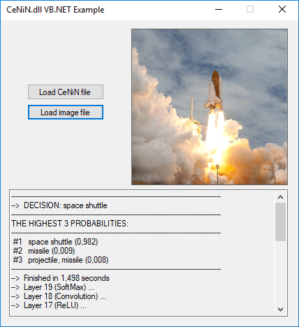

# CeNiN
**C**e**N**i**N** (means "fetus" in Turkish) is a minimal implementation of feed-forward phase of deep **C**onvolutional **N**eural **N**etworks in pure C#. It doesn't require any third party library and can be used in all programming languages supported by .NET.



There are two examples that illustrate how to use CeNiN in C# and VB.NET. You can find another one [here (**ImageTagger**)](https://www.codeproject.com/Articles/1360649/Image-Tagger-A-Convolutional-Neural-Network-Based).

## Pretrained Models
You can download two pretrained CeNiN models. These are actually two of VGG models of Oxford Visual Geometry Group. Parameters of those models are stored in ".cenin" files that allow millions of parameters to be loaded into memory quickly under .NET framework.  
- [imagenet-matconvnet-vgg-f.cenin (19 layers, 60824256  weights, 232MB)](https://drive.google.com/file/d/12Z0zkcLFMAvReBYomj1thrU-Aj1EJYKZ/view?usp=sharing
)
- [imagenet-vgg-verydeep-16.cenin (37 layers, 138344128 weights, 528MB)](https://drive.google.com/file/d/1t3Z3v1D625fByha19avQpNEiJm1AI-fD/view?usp=sharing)

## Performance
The most time-consuming layers are convolution layers. The other layers are fast enough without extra optimization.  
Below are the times taken to pass an image from all the layers of imagenet-matconvnet-vgg-f.cenin on Intel Core i7-6500U CPU 2.50GHz and 8GB RAM:  
***Conv_1*:** 7548 ms - The simplest implementation  
***Conv_2*:** 6763 ms - I used the approach explained in a paper by Nvidia (no, not using GPUs :D). It is not much faster than the first one because of the indexing approach that I used in *Tensor* class.  
***Conv_3*:** 1975 ms - The same as *Conv_2*, but this time with non-repetitive multiplications while indexing.  
***Conv*:** 1031 ms - The only difference between this and *Conv_3* is parallelization. This is faster than *Conv_3* only on multicore CPUs. A faster generalized matrix multiplication approach can make it even faster...  
***Conv* (useMKLCBLAS=true):** 151 ms - with Intel MKL BLAS support

## Intel MKL Support (26/05/2019)
As of version 0.2 CeNiN supports using the Intel MKL library to speed up matrix multiplications if the following files are available in the same folder as CeNiN.dll:  
  - mkl_rt.dll,
  - mkl_intel_thread.dll
  - mkl_core.dll
  - libiomp5md.dll
  - mkl_def.dll
  - mkl_avx.dll
  - mkl_avx2.dll
  - mkl_avx512.dll
  - mkl_mc.dll
  - mkl_mc3.dll
These files can be found in "?:\Program Files (x86)\IntelSWTools\compilers_and_libraries_2019.3.203\windows\redist\intel64_win\mkl" after installing the Intel® Math Kernel Library from [this link](https://software.intel.com/en-us/mkl/choose-download).

## Training Your Own Models
Since backpropagation is not implemented yet, you can not train a model using this library. But if you have a trained model or want to train a model with another tool (like matconvnet) you can easily convert your trained model to a cenin file. CeNiN file structure is presented below. But there are some limitations because the implementation was kept as minimal as possible. (implemented layers: convolution, pool (max pooling only), relu, softmax)

### Implementing New Layer Types
You can implement new layer types inheriting *Layer* class. Structure of layers is simple and the same in all layer types. The following three implementations are required for a new type:
- a constructor that takes input dimensions (and also padding and/or stride parameters if required)
- implementation of *setOutputDims()* function if dimensions of input and output tensors are different. If they are the same, this function has a default implemetation in *Layer* class.
- implementation of *feedNext()* function. This function should start with a call to  *outputTensorMemAlloc()* and end with a call to *disposeInputTensor()*.

Note that there is no output tensor definition in any layer. Input of each layer is used as output of previous layer.
 
Note also that tensors that require padding are padded before they are being filled to prevent performance decrements caused by cloning memory regions. For this reason *writeNextLayerInput()* should be preferred to write output of current layer especially if left or top padding value is not zero on next layer. This is the only function that takes care of padding while writing data into input tensor of next layers...

Additionally you can find some function and operator definitions that may be useful while implementing new layer types, in *Tensor.cs*:
- Tensor reshaping,
- Tensor * Tensor (for rank-2 tensors only; generalized matrix multiplication),
- Tensor * float,
- Tensor + Tensor, Tensor - Tensor,
- Tensor + float, Tensor - float
- broadcasted addition (for rank-1 tensors only)

## .cenin File Format
This file format is structured so that it can be read under .NET framework using BinaryReader class very quickly. The structure is as follows (new lines are for representation, there is no new line in cenin files. [] and {} also for representation of data and types):  
```
CeNiN NEURAL NETWORK FILE   {string without an ending null char}
[LayerCount]                {1 x int32}
[InputSize]                 {3 x int32}
[AveragePixel]              {3 x float}
For each layer in network:
[LayerTypeStringLength]     {1 x byte (7-bit encoded int)}
[LayerType]                 {string}
[LayerParams]               {different numbers of parameters in different orders, please see CNN() constructor in CNN.cs}
EOF                         {string without an ending null char}
```
### vgg2cenin
A matlab function ([vgg2cenin](https://github.com/atasoyhus/CeNiN/blob/master/src/Converter/vgg2cenin.m)) that converts vgg format to cenin format is added under /src/Converter (14/05/2019).

## Links
- The paper that proposes a faster convolution approach (used in *Conv_2*, *Conv_3* and *Conv*):  
https://arxiv.org/abs/1410.0759
- Pretrained models (for matconvnet):  
http://www.vlfeat.org/matconvnet/pretrained/
- Visual Geometry Group (VGG)  
http://www.robots.ox.ac.uk/~vgg/
- The method that I used in *InputLayer* to read a bitmap quickly [in Turkish]:  
http://www.atasoyweb.net/Bitmapleri-Net-Catisi-Altinda-Hizlica-Isleme
- My blog post about this library [in Turkish]:  
http://www.atasoyweb.net/CeNiN-Konvolusyonel-Yapay-Sinir-Agi-Kutuphanesi
- My blog post about BLAS [in Turkish]:  
http://www.atasoyweb.net/MATLAB-in-Sihirli-Degnegi-BLAS